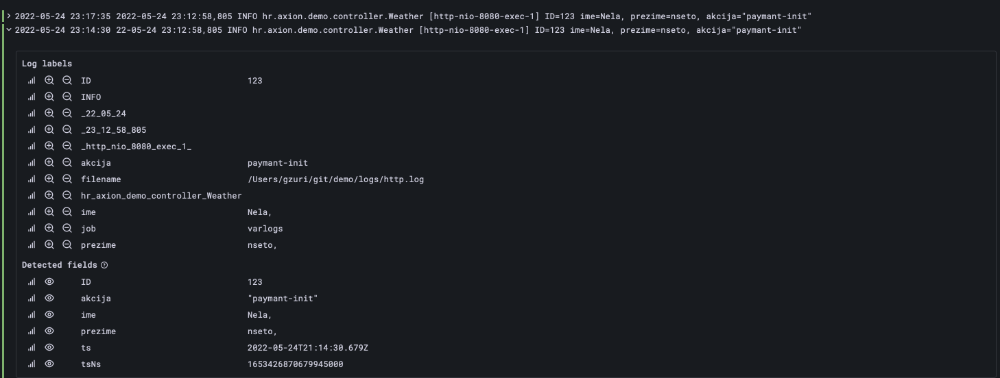

## Observability
### Logging
Every application needs to have proper logging in place in order to function, Spring Boot comes with LogBack and we will use it as is

PROPERLY USER LOG LEVELS! 

#### Installation
Add the following lines to your application.properties

```
logging.file.name=logs/application.log
logging.level.org.springframework=INFO
logging.pattern.file=%d{yyyy-MM-dd HH:mm:ss} traceID=%X{trace_id} - %msg  %n
logging.level.org.hibernate=error
```

#### Usage in code
Initialization and basic usage in the code
```
class ....
    Logger logger = LoggerFactory.getLogger(Weather.class);
    
    method
        logger.info("Updated user with userId={}", userId);
```

IMPORTANT: use proper field names like userId or even combined names like user.address=XXXX if you only use ambiguous names as id it will not help with operations. 

The above sample reflect the simple message with the simple payload, you can mix and match with String.formater, objectMappers etc as you need it, as long as the output stays the same

#### Structured logging
In order for the logs to be machine-readable they need to be structured so the data points can be easily extracted. 
The requirement of course can be resolved in different ways, and they include:
- **logfmt**, we will use the format in our Java code by default
- **json**, we can use it where available or if we need to dump some bigger information


#### Structured logging with logfmt
additional sources for logfmt:
- [splunk](https://dev.splunk.com/enterprise/docs/developapps/addsupport/logging/loggingbestpractices/)
- [DataDog](https://docs.datadoghq.com/logs/log_configuration/parsing/?tab=matchers0)
- [Loki (Grafana)](https://grafana.com/blog/2020/10/28/loki-2.0-released-transform-logs-as-youre-querying-them-and-set-up-alerts-within-loki/#filter)


In addition to the regular logging configuration that would have date(UTC) LOG_LEVEL class message, the message would be structured as a key value pairs that would be parsed in log aggregation system. 
```
key1=value1, key2=value2, key3=value3
```

#### Custom logger
If there are requirements beyond the capability of yaml/properties config you can put a custom logback-spring.xml in resources folder
```
<?xml version="1.0" encoding="UTF-8"?>
<configuration>

    <property name="LOGS" value="./logs" />

    <appender name="Console"
              class="ch.qos.logback.core.ConsoleAppender">
        <layout class="ch.qos.logback.classic.PatternLayout">
            <Pattern>
                %black(%d{ISO8601}) %highlight(%-5level) [%blue(%t)] %yellow(%C{1.}): %msg%n%throwable
            </Pattern>
        </layout>
    </appender>

    <appender name="RollingFile"
              class="ch.qos.logback.core.rolling.RollingFileAppender">
        <file>${LOGS}/spring-boot-logger.log</file>
        <encoder
                class="ch.qos.logback.classic.encoder.PatternLayoutEncoder">
            <Pattern>%d %p %C{1.} [%t] %m%n</Pattern>
        </encoder>

        <rollingPolicy
                class="ch.qos.logback.core.rolling.TimeBasedRollingPolicy">
            <!-- rollover daily and when the file reaches 10 MegaBytes -->
            <fileNamePattern>${LOGS}/archived/spring-boot-logger-%d{yyyy-MM-dd}.%i.log
            </fileNamePattern>
            <timeBasedFileNamingAndTriggeringPolicy
                    class="ch.qos.logback.core.rolling.SizeAndTimeBasedFNATP">
                <maxFileSize>10MB</maxFileSize>
            </timeBasedFileNamingAndTriggeringPolicy>
        </rollingPolicy>
    </appender>

    <!-- LOG everything at INFO level -->
    <root level="info">
        <appender-ref ref="RollingFile" />
        <appender-ref ref="Console" />
    </root>

    <logger name="hr.axion" level="trace" additivity="false">
        <appender-ref ref="RollingFile" />
        <appender-ref ref="Console" />
    </logger>
</configuration>
```

sources:
- [Grafana official Spring Boot tutorial](https://grafana.com/blog/2022/04/26/set-up-and-observe-a-spring-boot-application-with-grafana-cloud-prometheus-and-opentelemetry/)
- 


##### Grafana view
The log message that started as ```2022-05-24 23:14:30
22-05-24 23:12:58,805 INFO hr.axion.demo.controller.Weather [http-nio-8080-exec-1] ID=123 ime=Nela, prezime=nseto, akcija="paymant-init"```




### Tracing
To correlate logs we will use OpenTelemetry, for now with auto-instrumentation option that connects directly to JVM via javaagent. In essence there is no custom code or config necessary on the application side


#### Local setup
**This step is not necessary for development, it will be enabled on the server!** if you still want to try it out it is rather simple to setup (but you should have a grafana agent pre-installed otherwise you won't see the results).

1. download the latest jar for Java OpenTelemetry [OpenTelemetry Git](https://github.com/open-telemetry/opentelemetry-java)
2. add the following VM options (either when running via console or in IntellJ)
```
-javaagent:/Users/gzuri/git/opentelemetry-javaagent.jar
-Dotel.resource.attributes=service.name=demo-observability
-Dotel.traces.exporter=otlp
-Dotel.exporter.otlp.endpoint=http://127.0.0.1:4317
```
3. change the service.name to reflect the service you are building
4. that's it


sources:
- [Splunk and good information](https://www.splunk.com/en_us/data-insider/what-is-opentelemetry.html#important-to-devops)
- [Spring boot with Grafana](https://grafana.com/blog/2022/04/26/set-up-and-observe-a-spring-boot-application-with-grafana-cloud-prometheus-and-opentelemetry/https://grafana.com/blog/2022/04/26/set-up-and-observe-a-spring-boot-application-with-grafana-cloud-prometheus-and-opentelemetry/)
- [DataDog](https://docs.datadoghq.com/tracing/setup_overview/open_standards/)
- [AWS CloudWatch](https://docs.aws.amazon.com/AmazonCloudWatch/latest/monitoring/CloudWatch-Agent-open-telemetry.html)


### Lombok
One of the biggest complaints against Java is how much noise can be found in a single class. Project Lombok saw this as a problem and aims to reduce the noise of some of the worst offenders by replacing them with a simple set of annotations.

Most used annotations
- @Getter/@Setter - adds getter / setter
- @ToString - adds toString 
- @EqualsAndHashCode - adds equals and hashCode
- @Data - adds everything
